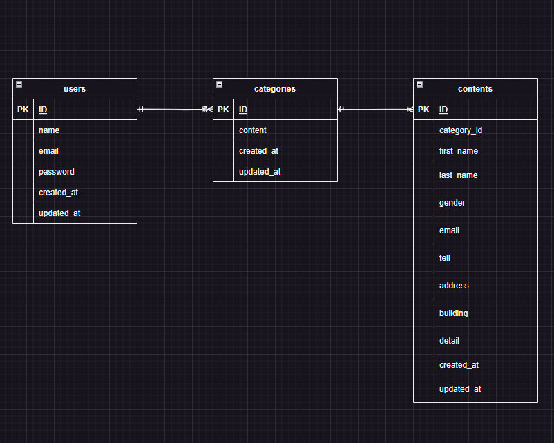

# お問い合わせフォーム

## 環境構築

### Dockerビルド
1.```
git clone https://github.com/takaokasayuko/ability-test.git
```

2.```
docker-compose up -d --build
```

*＊MySQLは、OSによってきどうしない場合があるのでそれぞれのPCに合わせてdocker-compose.ymlファイルを編集してください。*

### Laravel環境構築
1.```
docker-compose exec php bash
```

2.```
composer install
```

3.「.env.example」ファイルから.envを作成し、環境変数を変更
```
DB_CONNECTION=mysql
DB_HOST=mysql
DB_PORT=3306
DB_DATABASE=laravel_db
DB_USERNAME=laravel_user
DB_PASSWORD=laravel_pass
```

4.```
php artisan key:generate
```

5.```
php artisan migrate
```

6.```
php artisan db:seed
```

## 使用技術
・php 8.3.2

・Laravel 8.83.27

・MySQL 8.2.8

## ER図


## URL
・開発環境:http://localhost/

・phpMyAdmin:http://localhost:8080/
